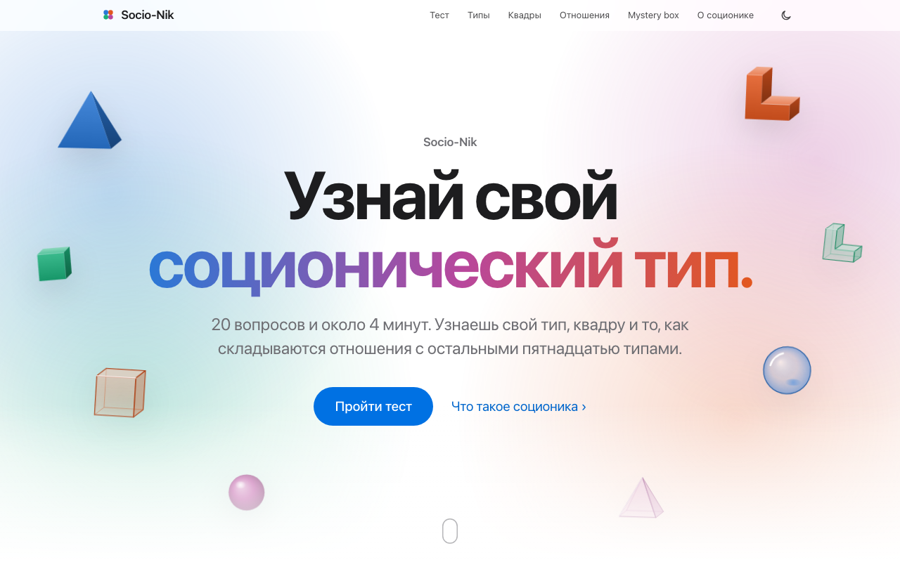
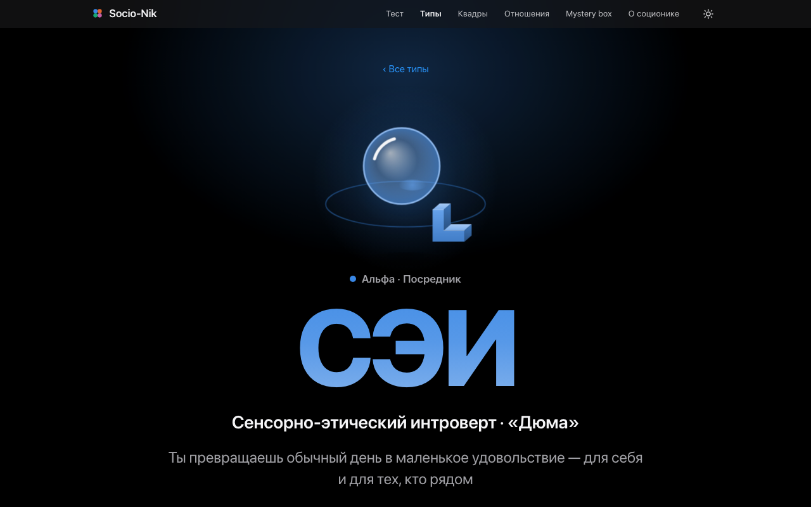
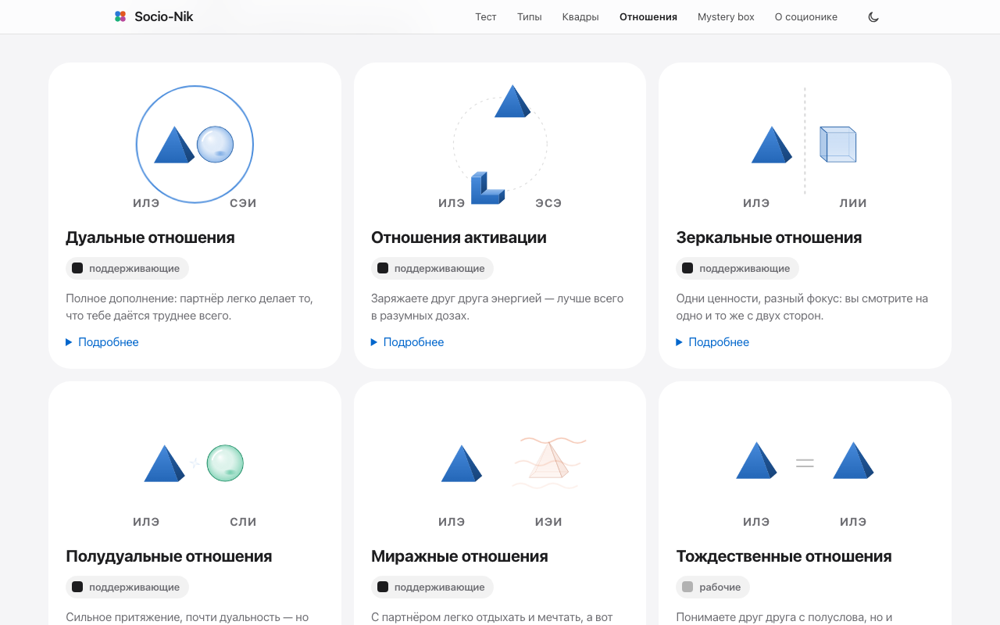
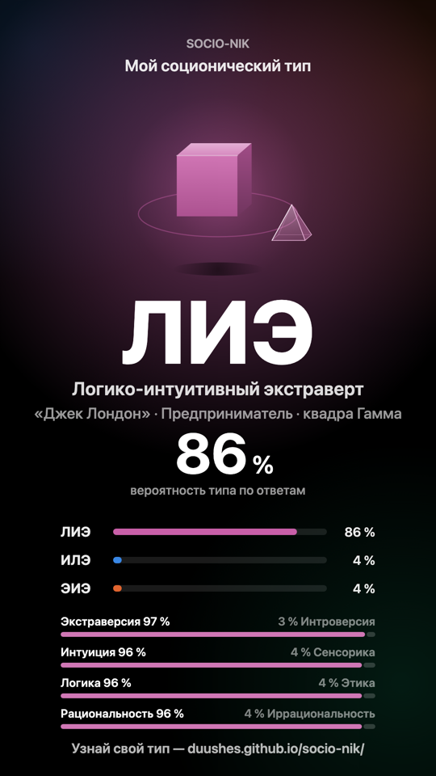

# Socio-Nik

Сайт по соционике в стиле Apple. Тест из 20 вопросов показывает соционический тип в процентах по всем 16 типам. Рядом — описания типов, квадр и 14 видов отношений, калькулятор совместимости, mystery box со случайными фактами и картинка результата для сторис.

**Открыть сайт:** https://duushes.github.io/socio-nik/



| Тип в тёмной теме | Отношения | Картинка для шера |
|---|---|---|
|  |  |  |

## Что внутри

- **Тест** — 20 вопросов по одному, шкала из 5 между двумя утверждениями, клавиши 1–5. Прогресс сохраняется, ответы остаются только в браузере.
- **Результат** — тип с процентом, четыре шкалы, распределение по 16 типам, квадра, дуал, сравнение с другом, картинка для сторис и поста.
- **Типы, квадры, отношения** — 16 страниц типов с моделью А (по нажатию на функцию — как она проявляется именно у этого типа: 128 текстов), 4 квадры, 14 видов отношений с анимированными сценами, матрица всех пар.
- **Ссылка на результат** — отдельная страница для получателя: чужой тип, приглашение пройти тест и, после теста, ваши отношения. Превью ссылки в мессенджерах — `site/og.jpg` (`node --experimental-websocket tools/og.js`).
- **Mystery box** — 3D-коробка и 212 фактов без повторов.
- **Иллюстрации** — свои: знаки аспектов в объёме (сенсорика — шар, интуиция — пирамида, логика — куб, этика — уголок), «чёрные» аспекты матовые, «белые» — стеклянные. Рисуются кодом из данных, одинаково в SVG и на canvas.

## Как запустить у себя

Скачай репозиторий и открой `site/index.html` двойным кликом — сервер, сборка и интернет не нужны. Одним файлом: `node tools/bundle.js index.html` соберёт `dist/index.html` со встроенными стилями и скриптами.

## Устройство

- `site/` — сайт: HTML, CSS и JS без фреймворков. Обычные `<script>` вместо модулей и данные в JS-файлах — чтобы всё работало и по `file://`.
  - `js/data/` — 16 типов, аспекты, квадры, отношения, вопросы; `js/core/` — модель А, подсчёт теста, код результата для ссылки;
  - `js/content/` — тексты; `js/art/` — иллюстрации; `js/fx/` — анимации; `js/views/` — экраны.
- `tools/` — проверки для разработки на Node 20.
- `SPEC.md` — спецификация.

Модель А и все отношения вычисляются из Эго типа (базовая и творческая функции), а не хранятся таблицей. Процент типа — произведение вероятностей его четырёх полюсов, поэтому по 16 типам всегда выходит 100 %.

## Проверки

```bash
node tools/run-tests.js                               # 25 юнит-тестов ядра
node tools/check-content.js                           # схема, длины и язык текстов
node --experimental-websocket tools/e2e.js --shots    # сквозные проверки в headless Chrome
```

Сквозным проверкам нужен `chrome-headless-shell` из кэша Playwright. На каждый пуш в `main` GitHub Actions гоняет юнит-тесты и проверку текстов, потом выкладывает `site/` на GitHub Pages.

## Честно о точности

Соционика — популярная типологическая модель, а не проверенный научный метод: академическая психология её не признаёт. Результат теста — повод понаблюдать за собой, а не диагноз.
